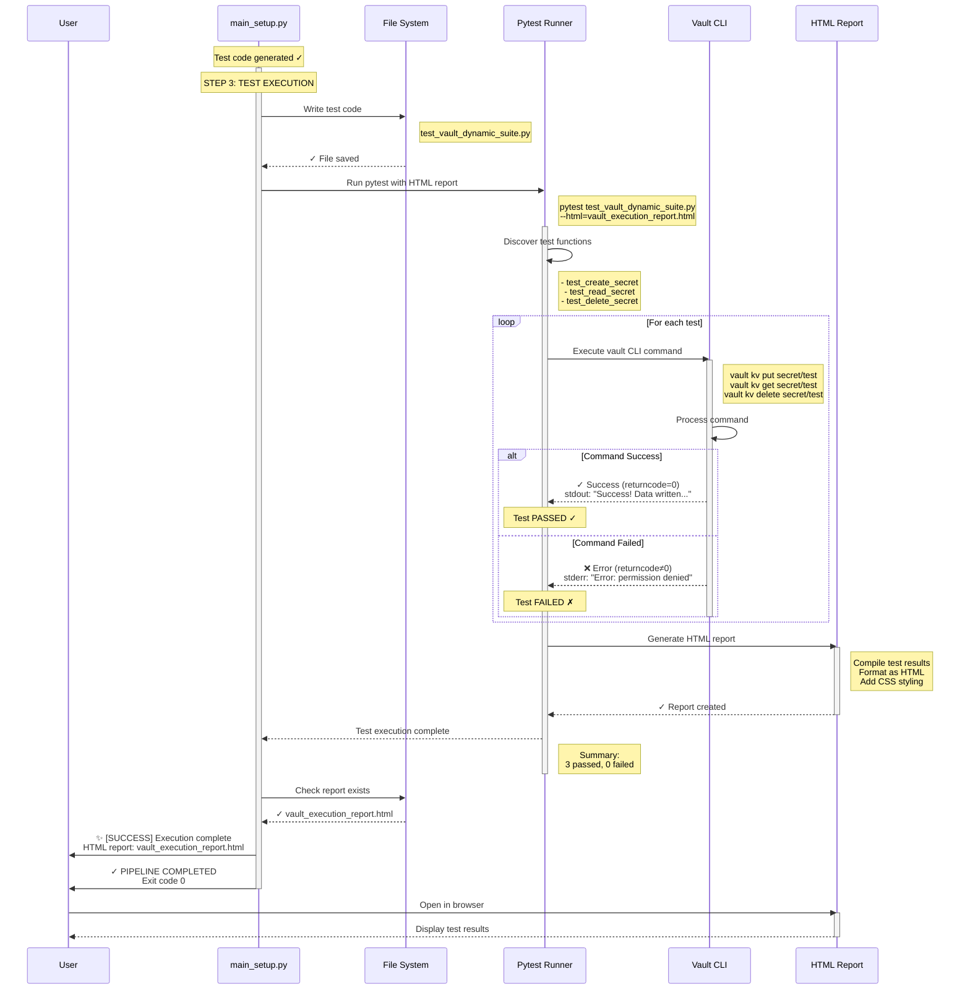
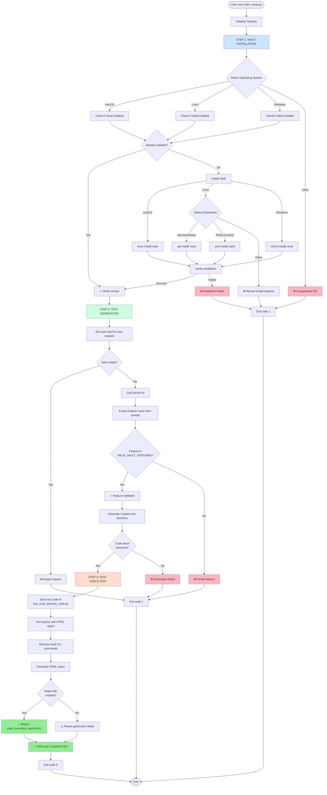
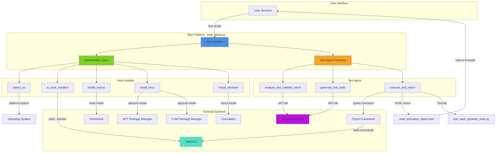
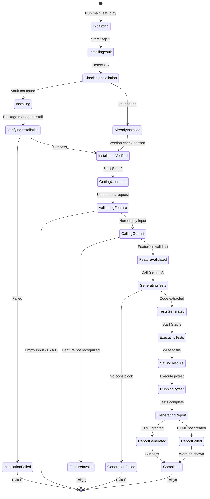
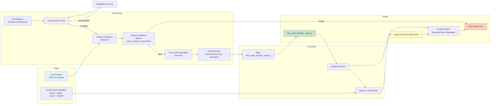

# Vault Setup and Test Generation Pipeline - Flow Diagram

## Overview
This document contains editable flow diagrams for the `main_setup.py` pipeline.

---

## 1. Sequence Diagrams (Separated by Step)

### 1.1 STEP 1: Vault Installation Sequence

```mermaid
sequenceDiagram
    participant User
    participant MainSetup as main_setup.py
    participant Installer as VaultInstaller
    participant System as OS/Package Manager

    User->>MainSetup: Run python main_setup.py
    activate MainSetup
    
    Note over MainSetup: STEP 1: VAULT INSTALLATION
    
    MainSetup->>Installer: Create VaultInstaller()
    activate Installer
    
    Installer->>System: Detect OS
    Note right of System: platform.system()<br/>platform.release()
    System-->>Installer: OS Info<br/>(Darwin/Linux/Windows)
    
    Installer->>System: Check if Vault installed
    Note right of System: vault --version
    
    alt Vault Already Installed
        System-->>Installer: ✓ Vault v1.15.0
        Installer-->>MainSetup: ✓ Installation verified
        deactivate Installer
        Note over MainSetup: Proceed to Step 2
        deactivate MainSetup
    else Vault Not Installed
        Installer->>System: Install Vault
        
        alt macOS
            Note right of System: brew tap hashicorp/tap<br/>brew install vault
        else Linux (Ubuntu/Debian)
            Note right of System: apt update<br/>apt install vault
        else Linux (RHEL/CentOS)
            Note right of System: yum install vault
        else Windows
            Note right of System: choco install vault
        end
        
        System-->>Installer: Installation complete
        
        Installer->>System: Verify installation
        Note right of System: vault --version
        
        alt Verification Success
            System-->>Installer: ✓ Vault v1.15.0
            Installer-->>MainSetup: ✓ Installation verified
            deactivate Installer
            Note over MainSetup: Proceed to Step 2
            deactivate MainSetup
        else Verification Failed
            System-->>Installer: ❌ Command not found
            Installer-->>MainSetup: ❌ Installation failed
            deactivate Installer
            MainSetup->>User: ❌ PIPELINE TERMINATED<br/>Exit code 1
            deactivate MainSetup
        end
    end
```

### 1.2 STEP 2: Test Generation Sequence

```mermaid
sequenceDiagram
    participant User
    participant MainSetup as main_setup.py
    participant Gemini as Gemini AI
    participant Validator as Feature Validator

    Note over MainSetup: Vault installation verified ✓
    
    activate MainSetup
    Note over MainSetup: STEP 2: TEST GENERATION
    
    MainSetup->>User: 📋 Enter your Vault feature test request:
    User-->>MainSetup: "I want to test KV2 secrets"
    
    MainSetup->>Gemini: analyze_and_validate_intent(prompt)
    activate Gemini
    
    Note right of Gemini: System Instruction:<br/>Extract feature name<br/>from user prompt
    
    Gemini->>Gemini: Process prompt with AI
    Gemini->>Validator: Extract feature: "kv"
    activate Validator
    
    Validator->>Validator: Check against<br/>VALID_VAULT_FEATURES
    Note right of Validator: ["kv", "database", "pki",<br/>"transit", "ldap", ...]
    
    alt Feature Valid
        Validator-->>Gemini: ✓ "kv" is valid
        deactivate Validator
        Gemini-->>MainSetup: ✓ Feature validated: "kv"
        deactivate Gemini
        
        MainSetup->>Gemini: generate_test_suite("kv")
        activate Gemini
        
        Note right of Gemini: System Instruction:<br/>Generate 3 pytest tests<br/>for KV2 feature
        
        Gemini->>Gemini: Generate Python code
        Note right of Gemini: - test_create_secret()<br/>- test_read_secret()<br/>- test_delete_secret()
        
        Gemini-->>MainSetup: Python test code<br/>(wrapped in ```python)
        deactivate Gemini
        
        MainSetup->>MainSetup: Extract code from markdown
        Note over MainSetup: Parse ```python ... ```
        
        MainSetup->>MainSetup: ✓ Test code ready
        Note over MainSetup: Proceed to Step 3
        deactivate MainSetup
        
    else Feature Invalid
        Validator-->>Gemini: ❌ "xyz" not in list
        deactivate Validator
        Gemini-->>MainSetup: None (validation failed)
        deactivate Gemini
        
        MainSetup->>User: ❌ PIPELINE TERMINATED<br/>Invalid feature<br/>Exit code 1
        deactivate MainSetup
    end
```

### 1.3 STEP 3: Test Execution Sequence



---

## 2. Detailed Flowchart



---

## 3. Component Interaction Diagram



---

## 4. State Transition Diagram



---

## 5. Data Flow Diagram



---

## How to Edit These Diagrams

### Using Mermaid Live Editor
1. Visit: https://mermaid.live/
2. Copy any diagram code from above
3. Paste into the editor
4. Edit the diagram visually or via code
5. Export as PNG, SVG, or copy updated code

### Supported Markdown Viewers
- GitHub (renders Mermaid natively)
- GitLab (renders Mermaid natively)
- VS Code (with Mermaid extension)
- Obsidian (with Mermaid plugin)
- Notion (paste as code block)

### Diagram Types Included
1. **Sequence Diagram** - Shows interaction between components over time
2. **Flowchart** - Detailed step-by-step decision flow
3. **Component Diagram** - System architecture and dependencies
4. **State Diagram** - State transitions during execution
5. **Data Flow Diagram** - How data moves through the system

### Quick Edit Guide

**To add a new step:**
```mermaid
NewStep[Description] --> NextStep
```

**To add a decision:**
```mermaid
Decision{Question?} -->|Yes| YesPath
Decision -->|No| NoPath
```

**To change colors:**
```mermaid
style NodeName fill:#HexColor
```

**To add notes:**
```mermaid
Note over Component: Note text
```

---

## Legend

### Colors
- 🔵 Blue: Installation steps
- 🟢 Green: Test generation steps
- 🟠 Orange: Test execution steps
- 🔴 Red: Error/failure states
- ⚪ White: Neutral/transition states

### Symbols
- ✓ Success
- ❌ Failure/Error
- ⚠️ Warning
- 🤖 AI/Automation
- 💾 File operation
- 🚀 Execution
- ✨ Completion

---

## Version History
- v1.0 (2026-05-29): Initial diagrams created for main_setup.py